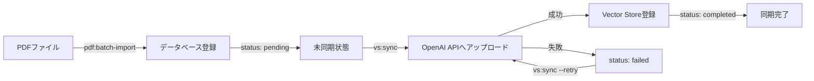

# RISS PM Session Trainer 管理者マニュアル

## 目次

1. [はじめに](#はじめに)
2. [初期セットアップ](#初期セットアップ)
3. [PDF管理](#pdf管理)
4. [ベクトルストア管理](#ベクトルストア管理)
5. [Filament管理画面の使用方法](#filament管理画面の使用方法)
6. [トラブルシューティング](#トラブルシューティング)

---

## はじめに

このマニュアルは、RISS PM Session Trainerシステムの管理者向けの運用ガイドです。特に以下の内容を含みます:

- システムの初期セットアップ手順
- 過去問PDFファイルのアップロードと管理
- OpenAI Vector Storeとの同期
- 日常的な運用タスク

### システム概要

このシステムは、情報処理安全確保支援士(RISS)試験の過去問PDFを管理し、AIを活用した学習支援を提供します。

**主要コンポーネント:**
- Laravel バックエンド (PHP)
- MySQL データベース
- OpenAI Vector Store (AI検索機能)
- Filament 管理パネル
- Docker コンテナ環境

---

## 初期セットアップ

### 前提条件

以下がインストールされていることを確認してください:
- Docker Desktop
- Git
- テキストエディタ (VS Code推奨)

### 1. プロジェクトのクローン

```bash
git clone <repository-url>
cd riss_pm_session_trainer
```

### 2. Docker環境の起動

```bash
cd docker
docker-compose up -d
```

**起動されるコンテナ:**
- `riss_app` - Laravelアプリケーション (ポート8000)
- `riss_mysql` - MySQLデータベース (ポート3306)
- `riss_phpmyadmin` - phpMyAdmin (ポート8080)

**確認方法:**
```bash
docker ps
```

3つのコンテナが`Up`状態であることを確認してください。

### 3. 環境変数の設定

```bash
cd ../backend
cp .env.example .env
```

`.env`ファイルを編集し、以下の項目を設定します:

```env
# アプリケーション設定
APP_NAME="RISS PM Session Trainer"
APP_ENV=local
APP_DEBUG=true
APP_URL=http://localhost:8000

# データベース設定 (docker-compose.ymlと一致させる)
DB_CONNECTION=mysql
DB_HOST=mysql
DB_PORT=3306
DB_DATABASE=riss
DB_USERNAME=riss
DB_PASSWORD=riss

# OpenAI設定 (後で設定)
OPENAI_API_KEY=your-api-key-here
OPENAI_MODEL=gpt-4-turbo-preview
OPENAI_VECTOR_STORE_ID=
```

> [!IMPORTANT]
> `OPENAI_API_KEY`は必須です。OpenAIのダッシュボードから取得してください。
> `OPENAI_VECTOR_STORE_ID`は次のステップで取得します。

### 4. 依存関係のインストール

Dockerコンテナ内で実行:

```bash
docker exec -it riss_app bash
composer install
npm install
```

### 5. アプリケーションキーの生成

```bash
docker exec -it riss_app php artisan key:generate
```

### 6. データベースのマイグレーション

```bash
docker exec -it riss_app php artisan migrate
```

### 7. 初期データのシード

```bash
docker exec -it riss_app php artisan db:seed
```

**作成されるデータ:**
- 管理者アカウント
  - メール: `admin@example.com`
  - パスワード: `password`
- カテゴリとサブカテゴリ
- セキュリティトリビア

### 8. ベクトルストアの初期化

> [!CAUTION]
> このコマンドは**初回のみ**実行してください。既存のベクトルストアを削除する場合を除き、再実行は不要です。

```bash
docker exec -it riss_app php artisan vs:init
```

**実行結果例:**
```
ベクトルストア 'RISS PM Past Exams' を作成中...
ベクトルストアが作成されました: vs_abc123xyz456
このIDを .env の OPENAI_VECTOR_STORE_ID に手動で設定してください。
```

**重要:** 表示されたベクトルストアID (`vs_abc123xyz456`) をコピーし、`.env`ファイルの`OPENAI_VECTOR_STORE_ID`に設定してください。

```env
OPENAI_VECTOR_STORE_ID=vs_abc123xyz456
```

### 9. アプリケーションの起動確認

ブラウザで以下のURLにアクセス:

- **フロントエンド:** http://localhost:8000
- **管理画面:** http://localhost:8000/admin
- **phpMyAdmin:** http://localhost:8080

管理画面にログイン:
- メール: `admin@example.com`
- パスワード: `password`

---

## PDF管理

### PDFファイルの命名規則

PDFファイルは以下の命名規則に従う必要があります:

**フォーマット:**
```
{西暦}{元号年}{時期}_sc_{区分}_{種別}.pdf
```

**パラメータ:**

| パラメータ | 説明 | 例 |
|----------|------|-----|
| 西暦 | 4桁の年 | `2024` |
| 元号年 | `h`(平成) または `r`(令和) + 年数 | `r06`, `h21` |
| 時期 | `h`(春期), `a`(秋期), `tokubetsu`(特別) | `h`, `a` |
| 試験区分 | `am2`, `pm1`, `pm2`, `pm` | `pm1` |
| 種別 | `qs`(問題), `ans`(解答), `cmnt`(解説) | `qs` |

**ファイル名の例:**

```
2024r06h_sc_pm1_qs.pdf      # 2024年(令和6年)春期 午後I 問題
2024r06h_sc_pm1_ans.pdf     # 2024年(令和6年)春期 午後I 解答
2024r06h_sc_pm1_cmnt.pdf    # 2024年(令和6年)春期 午後I 解説
2023r05a_sc_pm2_qs.pdf      # 2023年(令和5年)秋期 午後II 問題
2011h23tokubetsu_sc_pm_qs.pdf  # 2011年(平成23年)特別 午後 問題
```

> [!WARNING]
> 命名規則に従わないファイルは自動インポート時にスキップされます。

### PDFファイルのバッチインポート

#### 準備

1. PDFファイルを1つのディレクトリにまとめます
2. すべてのファイル名が命名規則に従っていることを確認します

#### インポート手順

```bash
docker exec -it riss_app php artisan pdf:batch-import /path/to/pdf/directory
```

**例:**
```bash
# Windowsの場合
docker exec -it riss_app php artisan pdf:batch-import "C:\Users\admin\Desktop\past_exams"

# コンテナ内のパスを使用する場合
docker exec -it riss_app php artisan pdf:batch-import /var/www/html/storage/app/temp_pdfs
```

**実行結果例:**
```
Found 15 PDF files. Parsing...
+----------------------------------+------+--------+--------+-----------+
| Filename                         | Year | Season | Period | Type      |
+----------------------------------+------+--------+--------+-----------+
| 2024r06h_sc_pm1_qs.pdf          | 2024 | spring | pm1    | question  |
| 2024r06h_sc_pm1_ans.pdf         | 2024 | spring | pm1    | answer    |
| 2024r06h_sc_pm1_cmnt.pdf        | 2024 | spring | pm1    | commentary|
+----------------------------------+------+--------+--------+-----------+

Registering 15 new files...

Import completed:
  - New registered: 15
  - Already exists (skipped): 0

Run `php artisan vs:sync` to sync new files with OpenAI.
```

#### オプション

```bash
# ドライラン (実際には登録せず、プレビューのみ)
docker exec -it riss_app php artisan pdf:batch-import /path/to/pdfs --dry-run

# 異なるディスクを指定
docker exec -it riss_app php artisan pdf:batch-import /path/to/pdfs --disk=s3

# 確認なしで実行
docker exec -it riss_app php artisan pdf:batch-import /path/to/pdfs --force
```

#### インポート後の確認

1. Filament管理画面にログイン
2. 「PDFソース管理」メニューをクリック
3. インポートされたファイルが表示されることを確認
4. `index_status`が`pending`(未処理)になっていることを確認

---

## ベクトルストア管理

### ベクトルストアとは

OpenAI Vector Storeは、PDFファイルをAIが検索・理解できる形式で保存するストレージです。PDFをアップロードすることで、AIが内容を理解し、質問に答えられるようになります。

### ベクトルストアへの同期

#### 全ての未同期ファイルを同期

```bash
docker exec -it riss_app php artisan vs:sync
```

**デフォルト動作:**
- `index_status`が`pending`のファイルのみ処理

**実行結果例:**
```
Found 15 pending file(s).
Processing: 2024r06h_sc_pm1_qs.pdf
  ✓ Synced successfully
Processing: 2024r06h_sc_pm1_ans.pdf
  ✓ Synced successfully
...

Sync completed: 15 success, 0 error(s).
```

#### オプション

```bash
# ドライラン (実際には同期せず、対象ファイルを表示)
docker exec -it riss_app php artisan vs:sync --dry-run

# 処理件数を変更
docker exec -it riss_app php artisan vs:sync --limit=50

# 失敗したファイルも再試行
docker exec -it riss_app php artisan vs:sync --retry
```

#### 同期ステータスの確認

Filament管理画面で確認:
1. 「PDFソース管理」を開く
2. 「状況」列を確認
   - **pending** (黄色): 未処理
   - **in_progress** (青色): 処理中
   - **completed** (緑色): 完了
   - **failed** (赤色): 失敗

### 同期の仕組み



---

## Filament管理画面の使用方法

### ログイン

1. http://localhost:8000/admin にアクセス
2. 管理者アカウントでログイン
   - メール: `admin@example.com`
   - パスワード: `password`

### PDFソース管理

#### 一覧表示

「PDFソース管理」メニューから、登録済みのPDFファイル一覧を確認できます。

**表示項目:**
- ファイル名
- 年
- 時期 (春/秋)
- 試験区分 (午前II/午後I/午後II)
- 資料種別 (問題/解答/解説)
- 状況 (pending/completed/failed)
- 完了日

#### フィルタリング

「状況」フィルタで表示を絞り込めます:
- 未処理
- 完了
- 失敗
- 処理中

#### 個別ファイルの同期

1. 対象ファイルの行にある「ベクトルストアと同期」ボタンをクリック
2. 確認ダイアログで「確認」をクリック
3. 同期が完了すると通知が表示されます

> [!TIP]
> 既に同期済みのファイルは「ベクトルストアと再同期」と表示されます。再同期すると、OpenAI側に新しいファイルが追加されます。

#### 一括同期

1. 同期したいファイルにチェックを入れる
2. テーブル下部の「選択したファイルをベクトルストアと同期」をクリック
3. 確認ダイアログで「確認」をクリック

> [!NOTE]
> 既に`completed`状態のファイルは一括同期の対象外です。

#### ファイルの編集

1. 対象ファイルの行にある「編集」アイコンをクリック
2. メタデータを編集
   - ファイル名
   - 年
   - 時期
   - 試験区分
   - 資料種別
3. 「保存」をクリック

> [!WARNING]
> ファイル自体を変更する場合、ベクトルストアとの再同期が必要です。

#### ファイルの削除

1. 対象ファイルの行にある「削除」アイコンをクリック
2. 確認ダイアログで「削除」をクリック

> [!CAUTION]
> データベースからは削除されますが、OpenAI Vector Store上のファイルは自動削除されません。必要に応じて手動で削除してください。

### その他の管理機能

#### カテゴリ管理

「カテゴリ」メニューから、問題のカテゴリを管理できます。

#### サブカテゴリ管理

「サブカテゴリ」メニューから、カテゴリ配下のサブカテゴリを管理できます。

#### セキュリティトリビア管理

「セキュリティトリビア」メニューから、学習用のトリビアを管理できます。

---

## トラブルシューティング

### よくある問題と解決方法

#### 1. Dockerコンテナが起動しない

**症状:**
```bash
docker-compose up -d
ERROR: ...
```

**解決方法:**
1. Docker Desktopが起動していることを確認
2. ポートの競合を確認 (8000, 3306, 8080)
3. ログを確認: `docker-compose logs`

#### 2. データベース接続エラー

**症状:**
```
SQLSTATE[HY000] [2002] Connection refused
```

**解決方法:**
1. MySQLコンテナが起動しているか確認: `docker ps`
2. `.env`のDB設定を確認 (特に`DB_HOST=mysql`)
3. コンテナを再起動: `docker-compose restart`

#### 3. ベクトルストア同期が失敗する

**症状:**
```
✗ Error: Timeout waiting for Vector Store processing
```

**解決方法:**
1. OpenAI APIキーが正しいか確認
2. OpenAI APIの利用制限を確認
3. `--limit`オプションで処理件数を減らす
4. 時間をおいて再試行: `php artisan vs:sync --retry`

#### 4. PDFファイルがインポートされない

**症状:**
```
The following files could not be parsed:
+----------------------------------+-----------------+
| Filename                         | Reason          |
+----------------------------------+-----------------+
| exam_2024.pdf                    | Pattern mismatch|
+----------------------------------+-----------------+
```

**解決方法:**
1. ファイル名が命名規則に従っているか確認
2. 拡張子が`.pdf`(小文字)であることを確認
3. ファイル名に特殊文字が含まれていないか確認

#### 5. 管理画面にログインできない

**症状:**
```
These credentials do not match our records.
```

**解決方法:**
1. シーダーが実行されているか確認: `php artisan db:seed`
2. デフォルト認証情報を確認:
   - メール: `admin@example.com`
   - パスワード: `password`
3. データベースを確認: phpMyAdmin (http://localhost:8080)

#### 6. ベクトルストアIDが見つからない

**症状:**
```
OpenAI Vector Store ID is not configured
```

**解決方法:**
1. `vs:init`コマンドを実行
2. 表示されたIDを`.env`の`OPENAI_VECTOR_STORE_ID`に設定
3. アプリケーションを再起動: `docker-compose restart app`

### ログの確認方法

#### Laravelログ

```bash
docker exec -it riss_app tail -f storage/logs/laravel.log
```

#### Dockerログ

```bash
# 全コンテナ
docker-compose logs -f

# 特定のコンテナ
docker-compose logs -f app
docker-compose logs -f mysql
```

### データベースのリセット

> [!CAUTION]
> この操作は全データを削除します。本番環境では絶対に実行しないでください。

```bash
docker exec -it riss_app php artisan migrate:fresh --seed
```

その後、ベクトルストアの再初期化が必要です:
```bash
docker exec -it riss_app php artisan vs:init
```

---

## 付録

### コマンドリファレンス

#### Artisanコマンド

| コマンド | 説明 |
|---------|------|
| `php artisan vs:init` | ベクトルストアを新規作成 |
| `php artisan vs:sync` | 未同期PDFをベクトルストアへ同期 |
| `php artisan pdf:batch-import <dir>` | PDFファイルを一括インポート |
| `php artisan migrate` | データベースマイグレーション実行 |
| `php artisan db:seed` | 初期データ投入 |
| `php artisan migrate:fresh --seed` | データベースリセット&シード |

#### Dockerコマンド

| コマンド | 説明 |
|---------|------|
| `docker-compose up -d` | コンテナを起動 |
| `docker-compose down` | コンテナを停止&削除 |
| `docker-compose restart` | コンテナを再起動 |
| `docker exec -it riss_app bash` | アプリコンテナに入る |
| `docker ps` | 起動中のコンテナ一覧 |
| `docker-compose logs -f` | ログをリアルタイム表示 |

### ディレクトリ構造

```
riss_pm_session_trainer/
├── backend/                    # Laravelアプリケーション
│   ├── app/
│   │   ├── Console/
│   │   │   └── Commands/      # Artisanコマンド
│   │   │       ├── VectorStoreInit.php
│   │   │       ├── VectorStoreSync.php
│   │   │       └── PdfBatchImport.php
│   │   ├── Filament/
│   │   │   └── Resources/     # Filament管理画面
│   │   ├── Models/            # データモデル
│   │   └── Services/          # ビジネスロジック
│   ├── database/
│   │   ├── migrations/        # DBマイグレーション
│   │   └── seeders/           # 初期データ
│   ├── storage/
│   │   └── app/
│   │       └── private/
│   │           └── pdfs/      # PDFファイル保存先
│   └── .env                   # 環境変数
└── docker/                    # Docker設定
    ├── docker-compose.yml
    └── Dockerfile
```

### 環境変数一覧

| 変数名 | 説明 | 例 |
|-------|------|-----|
| `APP_NAME` | アプリケーション名 | `RISS PM Session Trainer` |
| `APP_ENV` | 環境 | `local`, `production` |
| `APP_DEBUG` | デバッグモード | `true`, `false` |
| `DB_HOST` | データベースホスト | `mysql` |
| `DB_DATABASE` | データベース名 | `riss` |
| `DB_USERNAME` | データベースユーザー | `riss` |
| `DB_PASSWORD` | データベースパスワード | `riss` |
| `OPENAI_API_KEY` | OpenAI APIキー | `sk-...` |
| `OPENAI_MODEL` | 使用するAIモデル | `gpt-4-turbo-preview` |
| `OPENAI_VECTOR_STORE_ID` | ベクトルストアID | `vs_...` |

---

## サポート

問題が解決しない場合は、以下の情報を添えて開発チームに連絡してください:

1. エラーメッセージ全文
2. 実行したコマンド
3. Laravelログ (`storage/logs/laravel.log`)
4. 環境情報 (OS, Dockerバージョンなど)

---

**最終更新日:** 2026-01-22  
**バージョン:** 1.0
